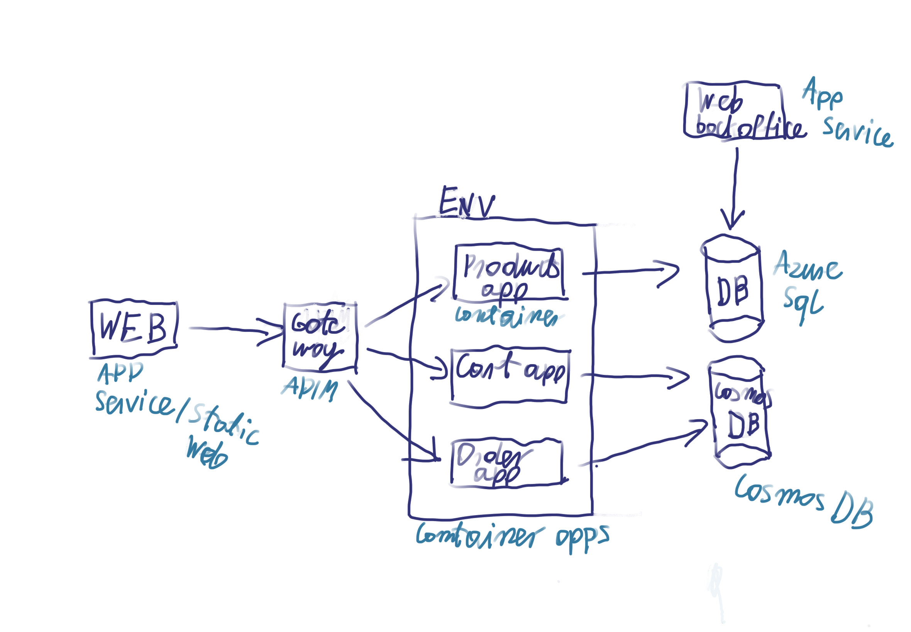

# Adventure Works Core
Is a sample E-Store application developed in latest version of .NET Core utilizing Azure as infrastructure. Purpose of this app is to show and verify latest technologies and patterns.

Application is split into two parts:
- e-commerce
- back-office

Each part of application try to utilize different cloud concepts\patterns ex. Container Apps service in e-commerce part.

## Current scope of work
- Develop .NET 6 minimal APIs in e-commerce
- Utilize Azure Container Apps service as infrastructure
- Setup CI/CD using GitHub actions

## Solution architecture
Below diagram show mockup of Solution Architecture and services utilized by current version of solution.
